# Go-Flutter Firebase Notification System 🚀

A complete end-to-end notification system implementation demonstrating **Golang** (Gin Framework) as the backend server and **Flutter** as the client application, integrated via **Firebase Cloud Messaging (FCM)**.

This project showcases how to handle **User ID based targeting**, separating the business logic (User IDs) from the technical implementation (FCM Tokens).

[](https://youtu.be/6us-dEgl0iw)

## ⚡ Golang Crash Course (For Developers)

If you are coming from Node.js, PHP, or Python, here is a quick overview of Go.

### What is Golang?
Go (or Golang) is an open-source programming language from Google.
* **Simple:** Syntax is similar to C but much cleaner (like Python/Node.js). No complex Classes, Inheritance, or Generics.
* **Compiled:** Code is compiled directly into machine code (binary). The result is a single `.exe` (Windows) or binary (Mac/Linux) file that runs without installing a runtime (unlike Node.js which needs `node_modules`).
* **Fast & Lightweight:** Extremely popular for Backends, Microservices, and Cloud due to efficient memory management.

### Analogy for You (Node.js/PHP Users)

| Concept | Node.js | Golang |
| :--- | :--- | :--- |
| **Dependency** | `package.json` | `go.mod` |
| **Install Lib** | `npm install` | `go get` |
| **Entry Point** | `index.js` | `main.go` |
| **Run** | `node index.js` | `go run main.go` |
| **Build** | (Requires tools) | `go build` (creates .exe) |

### How to Install Golang
Since you are using Windows/macOS:
1.  **Download:** Visit [go.dev/dl](https://go.dev/dl/) and download the installer (MSI for Windows, PKG for macOS).
2.  **Install:** Click Next until finished. Environment variables are usually set automatically.
3.  **Verify:** Open a new Terminal/CMD and type:

    ```bash
    go version
    ```
    *If a version appears (e.g., `go version go1.23.0 ...`), you are successful.*

---

## 📋 Features

- **Device Registration:** Securely registers FCM tokens and maps them to User IDs in the backend.
- **Direct User Messaging:** Send notifications targeting a specific `user_id` (The backend handles token lookup).
- **Broadcast:** Send messages to all devices using FCM Topics.
- **Smart Routing:** Notifications contain data payloads (`screen`) to navigate users to specific pages (e.g., Chat Page, Promo Page) upon clicking.
- **Background & Terminated Handling:** Full support for receiving notifications when the app is in the foreground, background, or completely closed.
- **In-Memory Storage:** Uses a Go map for temporary storage (Simulation of a Database) for easy testing/demo purposes.

## ARCHITECTURE FLOW

```mermaid
flowchart TD
    %% Styling
    classDef client fill:#e3f2fd,stroke:#2196f3,stroke-width:2px,color:black
    classDef server fill:#e8f5e9,stroke:#4caf50,stroke-width:2px,color:black
    classDef cloud fill:#fff3e0,stroke:#ff9800,stroke-width:2px,color:black
    classDef data fill:#f3e5f5,stroke:#9c27b0,stroke-width:2px,color:black

    subgraph Mobile["📱 Flutter Client"]
        Start([Start]) --> Login[User Login / Connect]
        Login --> GetToken[Get FCM Token]
        GetToken --> RegAPI[POST /register UserID + Token]
        Receive[Receive Notification] --> Click[User Click Notification]
        Click --> Router{Check Payload Type}
        Router -->|screen: chat| PageA[Navigate to Chat Page]
        Router -->|screen: promo| PageB[Navigate to Promo Page]
        Router -->|screen: other| PageC[Navigate to Default Page]
    end

    subgraph Backend["⚙️ Golang Server"]
        RegAPI --> StoreRAM[(Token Storage Map UserID → Token)]
        
        Trigger([Notification Trigger]) --> SendAPI[POST /send-user TargetID + Message]
        SendAPI --> Lookup{Lookup Token by TargetID}
        StoreRAM --> Lookup
        
        Lookup -->|Token Found| BuildMsg[Construct FCM Payload]
        Lookup -->|Token Not Found| LogError[Log Error: Token not found]
        LogError --> EndError([End: Notification Failed])
        
        BuildMsg --> SendFCM[Send to Firebase Admin SDK]
    end

    subgraph Firebase["☁️ Firebase Cloud"]
        SendFCM --> CloudRoute[FCM Routes to Device]
        CloudRoute --> Receive
    end

    %% Class assignments
    class Start,Login,GetToken,RegAPI,Receive,Click,Router,PageA,PageB,PageC client
    class StoreRAM,Trigger,SendAPI,Lookup,BuildMsg,SendFCM,LogError server
    class CloudRoute cloud
    class StoreRAM data

    %% Additional connections
    PageA --> EndClient([End])
    PageB --> EndClient
    PageC --> EndClient
    EndError --> EndServer([End])
```



## 🛠️ Tech Stack

* **Backend:** Golang (1.23+), Gin Gonic (Web Framework), Firebase Admin SDK.
* **Frontend:** Flutter (3.x), `firebase_messaging`, `http`.
* **Infrastructure:** Firebase Cloud Messaging (FCM).

## 🚀 Getting Started

### Prerequisites

1. A **Firebase Project** with a generated `serviceAccountKey.json`.
2. **Golang** installed on your machine.
3. **Flutter SDK** installed.

---

### 1. Firebase Preparation (Prerequisite)

Before coding, ensure you have:

1. Created a Project in the [Firebase Console](https://console.firebase.google.com/).
2. Go to **Project Settings** > **Service Accounts**.
3. Click **Generate new private key**. This will download a `.json` file.
4. **Rename** this file to `serviceAccountKey.json`.
5. **Save** this file; we will put it in the Golang project folder later.

---

### 2. Backend Implementation (Golang)

This service receives tokens from the mobile app and handles notification dispatching.

**Project Structure:**

```text
go-flutter-firebase-notif/
    ├── main.go
    ├── serviceAccountKey.json  <-- Place your key here
    └── go.mod

```

**Initialization:**

```bash
mkdir go-flutter-firebase-notif
cd go-flutter-firebase-notif

# Initialize Module
go mod init go-flutter-firebase-notif

# Install Dependencies
go get [firebase.google.com/go/v4](https://firebase.google.com/go/v4)
go get [github.com/gin-gonic/gin](https://github.com/gin-gonic/gin)

```

**Code: `main.go`**

check in [main.go](https://github.com/CreatorB/go-flutter-firebase-notif/blob/main/main.go)

---

### 3. Frontend Implementation (Flutter)

**Prerequisites:**

1. Add `google-services.json` (Android) to `android/app/`.
2. Add permissions in `AndroidManifest.xml` (Internet & Post Notifications).
3. Add dependencies: `firebase_core`, `firebase_messaging`, `http`.

**Code: `test_fcm_page.dart`**
A dedicated page to test the connection and send messages.

```dart
import 'dart:convert';
import 'package:firebase_messaging/firebase_messaging.dart';
import 'package:flutter/material.dart';
import 'package:http/http.dart' as http;

class TestFcmPage extends StatefulWidget {
  const TestFcmPage({super.key});

  @override
  State<TestFcmPage> createState() => _TestFcmPageState();
}

class _TestFcmPageState extends State<TestFcmPage> {
  // Input Controllers
  // Ganti IP ini dengan IP localhost
  final _ipController = TextEditingController(text: "192.168.50.100:8081");
  
  final _myUserIdController = TextEditingController(text: "user_1"); // ID Saya
  final _targetUserIdController = TextEditingController(text: "user_2"); // ID Target
  final _titleController = TextEditingController(text: "Halo");
  final _bodyController = TextEditingController(text: "Apa kabar?");

  // State Variables
  String _statusLog = "Siap...";
  bool _isConnected = false;
  String? _myToken;

  // Fungsi helper untuk Log
  void _addLog(String log) {
    if (!mounted) return;
    setState(() => _statusLog = "$log\n---\n$_statusLog");
  }

  @override
  void initState() {
    super.initState();
    
    // 1. SETUP LISTENER REFRESH
    // Fungsi ini akan terpanggil otomatis JIKA token berubah sendiri
    FirebaseMessaging.instance.onTokenRefresh.listen((newToken) {
      print("♻️ Token Ter-Refresh Otomatis!");
      
      // Update variabel lokal
      if (mounted) {
        setState(() => _myToken = newToken);
      }
      
      // PENTING: Segera kirim token baru ini ke Backend Golang
      // supaya database Backend tetap sinkron.
      _updateTokenToBackend(newToken);
    });
  }

  // --- FUNGSI LOGIKA ---

  // 1. REGISTER SEBAGAI USER ID TERTENTU
  Future<void> _connectAsUser() async {
    String ip = _ipController.text.trim();
    String myId = _myUserIdController.text.trim();

    if (ip.isEmpty || myId.isEmpty) return;

    try {
      _addLog("⏳ Registering as '$myId'...");

      // Ambil Token Firebase
      FirebaseMessaging messaging = FirebaseMessaging.instance;
      await messaging.requestPermission();

      // Subscribe ke topic "news" (Opsional untuk broadcast)
      await messaging.subscribeToTopic("news");
      _addLog("✅ Subscribed to Topic: news");

      String? token = await messaging.getToken();

      if (token == null) {
        _addLog("❌ Gagal dapat token");
        return;
      }

      // Simpan token ke variabel lokal
      setState(() {
        _myToken = token;
      });

      // Kirim ke Backend Go
      final res = await http.post(
        Uri.parse("http://$ip/register"),
        body: jsonEncode({"user_id": myId, "token": token}),
      );

      if (res.statusCode == 200) {
        if (!mounted) return;
        setState(() => _isConnected = true);
        _addLog("✅ Login Sukses sebagai: $myId");
      } else {
        _addLog("❌ Server Error: ${res.statusCode}");
      }
    } catch (e) {
      _addLog("❌ Error: $e");
    }
  }

  // 2. KIRIM KE USER ID LAIN (Bukan Token)
  Future<void> _sendToUser() async {
    if (!_isConnected) {
      _addLog("⚠️ Login dulu!");
      return;
    }

    String ip = _ipController.text.trim();
    String targetId = _targetUserIdController.text.trim();

    try {
      _addLog("🚀 Mengirim ke User: $targetId...");

      final res = await http.post(
        Uri.parse("http://$ip/send-user"),
        body: jsonEncode({
          "target_user_id": targetId,
          "title": _titleController.text,
          "body": _bodyController.text,
        }),
      );

      if (res.statusCode == 200) {
        _addLog("✅ Terkirim ke $targetId!");
      } else if (res.statusCode == 404) {
        _addLog("⚠️ User '$targetId' tidak ditemukan/belum login di server.");
      } else {
        _addLog("❌ Gagal: ${res.body}");
      }
    } catch (e) {
      _addLog("❌ Error: $e");
    }
  }

  // 3. KIRIM BROADCAST (Simulasi Admin)
  Future<void> _sendBroadcast() async {
    if (!_isConnected) {
      _addLog("⚠️ Login dulu untuk set IP server.");
      return;
    }
    
    String ip = _ipController.text.trim();

    try {
      _addLog("📢 Mengirim Broadcast ke topic 'news'...");

      final res = await http.post(
        Uri.parse("http://$ip/broadcast"),
        body: jsonEncode({
          "topic": "news", // Topic target
          "title": "⚡ DISKON FLASH SALE!",
          "body": "Semua user dapat diskon 50% sekarang juga!"
        }),
      );

      if (res.statusCode == 200) {
        _addLog("✅ Broadcast Sukses!");
      } else {
        _addLog("❌ Gagal: ${res.body}");
      }
    } catch (e) {
      _addLog("❌ Error: $e");
    }
  }

  // 4. UPDATE TOKEN SAAT REFRESH
  Future<void> _updateTokenToBackend(String token) async {
    String ip = _ipController.text.trim();
    String myId = _myUserIdController.text.trim();
    
    if (ip.isEmpty || myId.isEmpty) return;

    try {
      await http.post(
        Uri.parse("http://$ip/register"),
        body: jsonEncode({
          "user_id": myId,
          "token": token
        }),
      );
      print("✅ Token baru berhasil diupdate ke server");
    } catch (e) {
      print("❌ Gagal update token: $e");
    }
  }

  // --- UI BUILD ---
  @override
  Widget build(BuildContext context) {
    return Scaffold(
      appBar: AppBar(title: const Text("FCM By User ID")),
      body: SingleChildScrollView(
        padding: const EdgeInsets.all(16),
        child: Column(
          crossAxisAlignment: CrossAxisAlignment.start,
          children: [
            // SETUP
            const Text(
              "1. Setup & Login",
              style: TextStyle(fontWeight: FontWeight.bold),
            ),
            TextField(
              controller: _ipController,
              decoration: const InputDecoration(labelText: "IP Server Go (ex: 192.168.1.5:8080)"),
            ),
            const SizedBox(height: 10),
            Row(
              children: [
                Expanded(
                  child: TextField(
                    controller: _myUserIdController,
                    decoration: const InputDecoration(
                      labelText: "Login Sebagai User ID",
                      border: OutlineInputBorder(),
                    ),
                  ),
                ),
                const SizedBox(width: 10),
                ElevatedButton(
                  onPressed: _connectAsUser,
                  child: const Text("LOGIN"),
                ),
              ],
            ),
            
            // Tampilkan Token Sendiri (Untuk Debug)
            if (_myToken != null) 
              Padding(
                padding: const EdgeInsets.only(top: 8.0),
                child: Text("Token Saya: ${_myToken!.substring(0, 15)}...", style: const TextStyle(fontSize: 10, color: Colors.grey)),
              ),

            const Divider(),

            // ACTION
            const Text(
              "2. Kirim ke User Lain",
              style: TextStyle(fontWeight: FontWeight.bold),
            ),
            const SizedBox(height: 10),
            TextField(
              controller: _targetUserIdController,
              decoration: const InputDecoration(
                labelText: "User ID Tujuan (Target)",
                border: OutlineInputBorder(),
                prefixIcon: Icon(Icons.person),
              ),
            ),
            const SizedBox(height: 10),
            TextField(
              controller: _titleController,
              decoration: const InputDecoration(labelText: "Judul"),
            ),
            TextField(
              controller: _bodyController,
              decoration: const InputDecoration(labelText: "Pesan"),
            ),
            const SizedBox(height: 10),

            SizedBox(
              width: double.infinity,
              child: ElevatedButton.icon(
                onPressed: _sendToUser,
                icon: const Icon(Icons.send),
                label: const Text("KIRIM BY ID"),
                style: ElevatedButton.styleFrom(
                  backgroundColor: Colors.indigo,
                  foregroundColor: Colors.white,
                ),
              ),
            ),

            const Divider(),
            const Text(
              "3. ADMIN AREA: Broadcast",
              style: TextStyle(fontWeight: FontWeight.bold, color: Colors.red),
            ),

            const SizedBox(height: 10),
            SizedBox(
              width: double.infinity,
              child: ElevatedButton.icon(
                onPressed: _sendBroadcast,
                icon: const Icon(Icons.campaign),
                label: const Text("KIRIM BROADCAST (SEMUA USER)"),
                style: ElevatedButton.styleFrom(
                  backgroundColor: Colors.redAccent,
                  foregroundColor: Colors.white,
                ),
              ),
            ),

            const Divider(),
            const Text("Log Aktivitas:"),
            Container(
              height: 200,
              width: double.infinity,
              color: Colors.grey[200],
              padding: const EdgeInsets.all(8),
              child: SingleChildScrollView(child: Text(_statusLog)),
            ),
          ],
        ),
      ),
    );
  }
}
```

---

## 🚀 How to Run

1. **Start Backend:**

```bash
cd go-flutter-firebase-notif
go run main.go
```


2. **Start Frontend:**
Connect your physical Android device via USB.

```bash
flutter run
```

3. **Testing:**
* Enter your Laptop's LAN IP in the App.
* Click **Login**.
* Enter a Target ID and click **Send**.

## 🔌 API Documentation

Since the project is designed for demo purposes, you can test it using Postman or CURL.

### 1. Register User (Login Simulation)

Used by the Flutter app to register the device token.

* **URL:** `POST /register`

* **Body:**

```json
{
  "user_id": "john_doe",
  "token": "f7a_token_from_firebase..."
}

```

### 2. Send Notification by User ID

Send a message to a specific user without knowing their token.

* **URL:** `POST /send-user`
* **Body:**
```json
{
  "target_user_id": "john_doe",
  "title": "Hello John",
  "body": "You have a new message!",
  "screen": "chat"  
}

```


*(Note: `screen` parameter triggers navigation in the Flutter app)*

### 3. System Check

* **URL:** `GET /ping`
* **Response:** `{"message": "pong"}`

---

## 🧪 Testing Scenarios

1. **Peer-to-Peer Test:** Open the app on two devices (or 1 device + 1 emulator). Login as `user_A` and `user_B`. Send a message from A to B using the in-app UI.
2. **Routing Test:** Send a request via Postman with `"screen": "promo"`. Click the notification on the phone; the app should open directly to the Promo Page.

## 📝 License

This project is open-source and available under the [MIT License](https://opensource.org/license/mit).
